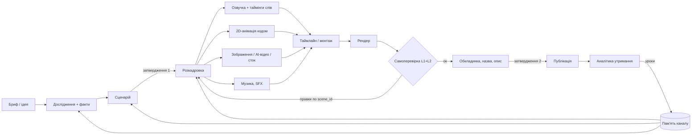

# Універсальний агент-контентмейкер: аналіз і проєкт

_Жовтень 2026. Дослідження інструментів, архітектура, самоперевірка, вартість, ризики та план побудови._

## 1. Коротка відповідь

**Так, це реально.** Агент, який сам проходить шлях від ідеї до змонтованого відео з 2D-анімацією і перевіряє свою роботу, у 2026 році збирається з готових частин. Під кожен етап уже є зрілі інструменти, а перші open-source спроби зробити саме це вже існують ([OpenMontage](https://github.com/calesthio/OpenMontage)).

Але є межі, про які краще знати наперед:

| Етап | Наскільки автоматизується | Коментар |
|---|---|---|
| Ідеї, ніша, назви | **повністю** | уже є: `niche_core` (аналіз ніш, вириви, шаблони назв) |
| Дослідження і сценарій | **повністю**, з факт-чеком | ризик галюцинацій, тому потрібні джерела в кожному факті |
| Озвучка | **повністю** | уже є: `sleep_voice` (Kokoro / OpenAI / ElevenLabs / Chatterbox) |
| 2D-анімація | **майже повністю** | найкраще «кодом» (Remotion / Motion Canvas): контрольовано, дешево, консистентно |
| Зображення, персонажі | **майже повністю** | моделі 2026 року тримають персонажа за референсами |
| Монтаж | **майже повністю** | таймлайн як дані, тож правки точкові, а рендер детермінований |
| «Справжнє» відео (AI-генерація) | **частково** | кліпи по 5–10 с, $0,07–0,40/с; годиться для b-roll, але не для цілого відео |
| Самоперевірка технічна | **повністю** | гучність, тиша, чорні та завислі кадри, ритм склейок, субтитри |
| Самоперевірка «на смак» | **частково** | мультимодальні моделі помічають очевидне, але смак гірше; потрібне калібрування |
| Навчання на аналітиці | **повністю** | YouTube Analytics API віддає криву утримання по секундах |
| Публікація | **частково** | неаудитовані API-проєкти можуть завантажувати лише приватні відео |

**Реалістична ціль:** людина витрачає **10–20 хвилин на відео** у двох точках затвердження (ідея + сценарій і фінальний перегляд), а не години. Повний автопілот технічно можливий, але для монетизованого каналу ризикований. Причини в розділі 9.

## 2. Головний принцип: «відео як код»

Більшість наявних автоматизаторів (слайдшоу зі стоку, InVideo, Pictory тощо) генерують відео як **непрозорий результат**. Якщо щось не так, переробляти доводиться все.

Ключове рішення цього проєкту: **кожен етап пише структуровані дані в папку проєкту**, а відео рендериться з них детерміновано.

```
project/
  brief.json          ідея, ціль, формат, тривалість, аудиторія
  research.json       факти + джерела (URL, цитата)
  script.md           сценарій з розміткою сцен і бітів
  storyboard.json     кадри: для кожного біта — тип візуалу, опис, асет, анімація
  assets/             зображення, кліпи, музика, SFX (+ licenses.json: звідки і на яких умовах)
  voice/              озвучка + word timestamps (слово → час)
  timeline.json       монтаж: доріжки, кліпи, переходи, субтитри, рівні гучності
  render/             відрендерені сцени + фінальне відео
  review/             звіти перевірок з таймкодами і scene_id
```

Що це дає:
- **Точкові правки.** Критик каже «сцена 14, 2:31–2:38: візуал не відповідає тексту». Агент перегенеровує лише асет сцени 14 і перерендерює лише її.
- **Відтворюваність.** Той самий `timeline.json` завжди дає те саме відео.
- **Незалежність від постачальників.** Sora закрили у 2026 році, і від цього ламається лише один адаптер, а не весь пайплайн.
- **Людина може втрутитися будь-де.** Виправити один рядок сценарію чи замінити одну картинку, не чіпаючи решти.

## 3. Архітектура



**Оркестратор:** Claude через Claude Agent SDK, або на старті Claude Code зі skills. Під ним працюють спеціалізовані субагенти, кожен зі своїми інструментами:

| Роль | Що робить | Інструменти |
|---|---|---|
| **Продюсер** (оркестратор) | веде проєкт за станами, стежить за бюджетом і дедлайнами, кличе людину на затвердження | Claude Agent SDK, файли проєкту |
| **Стратег** | ідеї, ніші, назви, конкуренти | `niche_core` (вже є), YouTube Data API |
| **Дослідник** | факти з джерелами, хронологія, цитати | веб-пошук, читання сторінок і PDF |
| **Сценарист** | сценарій під формат: хук у перші 5–30 с, структура утримання, ритм | правила формату + пам'ять каналу |
| **Арт-директор** | стиль-гайд: палітра, шрифти, персонажі (character sheets), розкадровка | генерація зображень з референсами |
| **Аніматор** | пише сцени в Remotion / Motion Canvas з бібліотеки шаблонів; Lottie для персонажів та іконок | Remotion + офіційний agent skill, Lottie |
| **Генератор асетів** | зображення, AI-кліпи, сток, музика, SFX; записує ліцензії | Nano Banana / GPT Image / FLUX.2, Seedance / Kling / Veo / Wan, Pexels / Pixabay, ElevenLabs Music / Stable Audio |
| **Диктор** | озвучка + таймінги слів | `sleep_voice` (вже є) + WhisperX для вирівнювання |
| **Монтажер** | збирає `timeline.json`: склейки по словах, переходи, субтитри, музика з приглушенням під голос | правила монтажу формату, ffmpeg |
| **Критик (QA)** | перевіряє рендер (розділ 5) і повертає правки з таймкодами | ffmpeg / ffprobe, PySceneDetect, OCR, Gemini (відео), Claude (кадри) |
| **Видавець** | обкладинка, назва, опис, розділи, субтитри, завантаження | генерація зображень, YouTube Data API |
| **Аналітик** | крива утримання → які сцени втрачають глядачів → уроки | YouTube Analytics API |

## 4. Універсальність: як не прив'язуватися до ніші

Універсальність досягається **конфігурацією, а не кодом**. Є два шари.

**1. Пакети форматів (format packs).** Кожен пакет — це набір правил і шаблонів:
- `explainer-2d`: пояснювальне відео з анімованими схемами, персонажами й кінетичним текстом;
- `documentary`: документалка (зображення з Ken Burns, архівні та стокові кадри, карти, таймлайни);
- `sleep-doc`: повільні візуали, без різких змін, 1–3 години (тут уже є `sleep_voice`);
- `listicle`: топ-N з лічильником;
- `shorts-facts`: вертикально, 30–60 с, хук за 1 с, динамічні субтитри;
- `tutorial`: запис екрана, зуми, підсвічування;
- `presenter`: AI-аватар або ваше відео плюс графіка.

Пакет визначає структуру сценарію, середню довжину кадру, типи візуалів, стиль субтитрів, гучність і пороги для критика.

**2. Біблія каналу (channel bible).** Вона генерується автоматично з 3–5 відео-референсів, які ви вкажете (свої або канали, які подобаються). Агент їх «переглядає» і виписує:
- тон і лексику;
- темп мовлення;
- середню довжину кадру;
- палітру й шрифти;
- тип графіки;
- як влаштовані хуки й переходи;
- персонажів.

Далі біблія поповнюється уроками з аналітики.

Так одна система робить і сліп-документалки, і Shorts про футбол, і туторіали. Змінюються тільки пакет і біблія.

## 5. Самоперевірка: найважливіша частина

Ось головна проблема агентів, що роблять відео «кодом»: **«скомпілювалося» не означає «добре»** ([Video as Code: the agent feedback gap](https://www.digitalapplied.com/blog/video-as-code-remotion-agentic-generation-2026)). Тому критик має чотири рівні.

### L0: перевірка до рендеру (безкоштовно, миттєво)
- Довжина сценарію відповідає цільовій тривалості (за реальним темпом голосу).
- Кожен факт має джерело.
- Кожен кадр розкадровки має асет, а кожен асет — записану ліцензію.
- Субтитри не задовгі, текст на екрані вміщається в безпечну зону.
- Немає однакових кадрів поспіль; жоден кадр не стоїть довше за ліміт формату.

### L1: технічна перевірка рендеру (детерміновано, ffmpeg / ffprobe)
- Гучність (LUFS) і пік відповідають формату (−14 для звичайного, −20 для сну); немає кліпінгу.
- Немає несподіваної тиші, чорних кадрів (`blackdetect`) і завислих кадрів (`freezedetect`).
- **Ритм монтажу:** розподіл довжини кадрів (PySceneDetect) порівнюється з пакетом формату й біблією каналу.
- Синхрон аудіо й відео, субтитри збігаються з таймінгами слів.
- **OCR кадрів:** «каша» замість тексту на AI-зображеннях, текст за краєм кадру.
- Консистентність персонажа: числова схожість кадрів із референсом (CLIP або DINO, як у [VBench](https://openaccess.thecvf.com/content/CVPR2024/papers/Huang_VBench_Comprehensive_Benchmark_Suite_for_Video_Generative_Models_CVPR_2024_paper.pdf)).

### L2: «перегляд» мультимодальною моделлю (смислова перевірка)
- **Gemini** приймає відео зі звуком напряму, з таймкодами ([Gemini video understanding](https://ai.google.dev/gemini-api/docs/video-understanding)). Але він дивиться приблизно 1 кадр за секунду, тож швидкі склейки може пропустити.
- **Claude** відео напряму не приймає ([станом на вересень–жовтень 2026](https://animspec.com/blog/can-claude-watch-videos)). Тому він отримує ключові кадри з кожної сцени (через детектор склейок) плюс транскрипт із таймкодами.
- Обидва оцінюють за **рубрикою формату**:
  - чи чіпляє хук (перші 5 і 30 секунд);
  - чи відповідає візуал тексту в кожній сцені;
  - чи немає монотонності;
  - чи немає AI-артефактів (руки, обличчя, «пливучі» об'єкти, текст);
  - чи тримається персонаж;
  - темп;
  - мікс голосу й музики;
  - читабельність субтитрів;
  - відповідність біблії каналу.
- **Результат** — структурований JSON: `[{t_start, t_end, scene_id, severity, category, problem, fix}]`.
- **Цикл правок:** таймкод → `scene_id` через таймлайн → агент виправляє лише цю сцену (новий асет, інший параметр анімації, інший таймінг) → перерендер сцени → повторна перевірка лише змінених місць. Зупинка: немає серйозних проблем або досягнуто ліміт ітерацій (наприклад, 3). Інакше питання передається людині з конкретним списком.
- **Два судді краще за одного.** Якщо Claude і Gemini не згодні щодо сцени, це сигнал показати її людині.
- **Калібрування.** Ваші оцінки й правки зберігаються і стають прикладами для критика. Дослідження 2026 року ([VideoScore2](https://arxiv.org/pdf/2608.09873), [UVE](https://arxiv.org/pdf/2503.09949)) показують, що моделі-судді корисні, але збіг з людськими оцінками ще не ідеальний. Тому смак калібруємо на ваших прикладах.

### L3: після публікації (вчиться на реальних глядачах)
- YouTube Analytics API віддає **криву утримання** для кожного відео (`elapsedVideoTimeRatio`, `audienceWatchRatio`, `relativeRetentionPerformance`, `startedWatching` / `stoppedWatching`) ([документація](https://developers.google.com/youtube/analytics/channel_reports)).
- Агент накладає провали кривої на `timeline.json`. Наприклад: «на 1:42 відвалилося 18%, там 12 секунд статичної карти» → урок у пам'ять каналу: «статичні карти довше 6 с втрачають глядачів».
- Наступні сценарії, розкадровки й правила критика враховують ці уроки. Ефект змін вимірюється так само, як ми калібрували `niche_core`: через бектест «до і після» на реальних даних.

## 6. Інструменти (жовтень 2026)

Ціни — орієнтири з відкритих джерел. Вони швидко змінюються, тож перед запуском перевіряються на офіційних сторінках.

### 2D-анімація «кодом» (основа візуалу)
| Інструмент | Плюси | Мінуси |
|---|---|---|
| **Remotion** (React) | найкращий інструментарій для агентів: є офіційний skill для Claude, рендер паралелиться | комерційна ліцензія потрібна компаніям; [безкоштовно до ~3 працівників](https://www.digitalapplied.com/blog/video-as-code-remotion-agentic-generation-2026), що для вас як соло-автора ок |
| **Motion Canvas / Revideo** | MIT, зручно для «ручної» анімації | менше готових інструментів для агентів |
| **Manim** | найкраще для математики й науки | вузька спеціалізація |
| **Lottie** (+ text-to-Lottie: [OmniLottie, CVPR 2026](https://openaccess.thecvf.com/content/CVPR2026/papers/Yang_OmniLottie_Generating_Vector_Animations_via_Parameterized_Lottie_Tokens_CVPR_2026_paper.pdf), [skill для Claude](https://github.com/diffusionstudio/lottie)) | векторні персонажі й іконки, що редагуються | складні рухи персонажів поки слабкі |

**Рекомендація:** Remotion як рушій, плюс **бібліотека шаблонів сцен**, яка росте з кожним відео: кінетичний текст, карти з маршрутами, таймлайни, графіки, порівняння, «плашки», персонажі в Lottie, Ken Burns для зображень. Агент не пише анімацію з нуля щоразу, а збирає її з перевірених блоків і параметрів. Так якість стабільна, а відео різні.

### Зображення та персонажі
- **Nano Banana 2.1 / Pro** (Google): до 4–5 референсів персонажа, сценарії для розкадровок ([документація](https://ai.google.dev/gemini-api/docs/image-generation)).
- **GPT Image 2** (OpenAI): сильний у збереженні персонажа за фото.
- **FLUX.2** (BFL): мультиреференс до 8–10, реалістичні текстури.
- Порада з тестів: тримати **один канонічний референс** персонажа і генерувати кожен кадр від нього, а не від попереднього кадру, бо так спотворення накопичуються.

### AI-відео (b-roll, «живі» кадри)
| Модель | Орієнтовна ціна | Примітка |
|---|---|---|
| Seedance 2.0 (ByteDance) | ~$0,07/с (480p) – $0,37/с (1080p) | найвищий рейтинг якості в липні 2026 |
| Wan 2.6 / 2.7 / 3.0 (Alibaba) | ~$0,08–0,10/с; **2.6 open-source** (можна запускати локально) | найдешевший |
| Kling 3.0 | ~$0,08–0,17/с | |
| Veo 3.1 (Google) | ~$0,05–0,40/с залежно від режиму | є 4K і звук |
| Runway Gen-4 / 4.5 | ~$0,05–0,12/с | |
| ~~Sora 2~~ | **закрита** (API вимкнено 24 вересня 2026) | приклад, чому потрібні адаптери |

Зручно підключати через агрегатор на кшталт fal.ai: один API для багатьох моделей ([порівняння цін](https://devtk.ai/en/blog/ai-video-generation-pricing-2026/)). Використовувати точково: 5–10-секундні кліпи для атмосфери. Цілий фільм з AI-відео поки дорогий і нестабільний.

### Аватари й ліпсинк (якщо потрібен «ведучий»)
HeyGen ≈ $1–5/хв, Hedra Character-3 ≈ $1,5–3,75/хв, OmniHuman ≈ $7–10/хв ([порівняння](https://www.hedra.com/blog/video-model-api-cost-comparison)).

### Голос, музика, сток
- **Голос:** `sleep_voice` (Kokoro безкоштовно, OpenAI ≈ $0,015/хв, ElevenLabs, Chatterbox). Додамо пресети для енергійних форматів.
- **Таймінги слів:** WhisperX або faster-whisper. Це основа для субтитрів і склейок «по слову».
- **Музика:**
  - [ElevenLabs Music](https://elevenlabs.io/docs/overview/capabilities/music): навчена на ліцензованих даних, комерційне використання на платних планах, ≈ $0,15/хв.
  - [Stable Audio 3](https://stability.ai/explainers/stable-audio-vs-competitors-licensing-export-rights-and-self-hosting-compared): відкриті ваги, безкоштовно для бізнесу з доходом до $1M.
  - Suno публічного API не має.
  - Ліцензія **не захищає від Content ID**, тому спершу завантажуємо відео як unlisted і перевіряємо претензії.
- **Сток:** [Pexels](https://help.pexels.com/hc/en-us/articles/360042295174-What-is-the-license-of-the-photos-and-videos-on-Pexels) і [Pixabay](https://pixabay.com/service/faq/) дозволяють комерційне використання без атрибуції. Ліцензію й дату кожного кліпу записуємо в `licenses.json`.

### Публікація та аналітика
- **Завантаження** (`videos.insert`): у неаудитованих API-проєктах, створених після липня 2020, **відео залишаються приватними**, поки проєкт не пройде аудит Google ([документація](https://developers.google.com/youtube/v3/docs/videos/insert)). Практичне рішення: агент завантажує як приватне чи відкладене, а ви одним кліком робите публічним. Або проходимо аудит.
- **A/B-тест обкладинок і назв** є лише в YouTube Studio, API для нього немає ([деталі](https://gyre.pro/blog/youtubes-new-title-ab-testing-tool-everything-creators-need-to-know)). Агент готує 3 варіанти, а запускаєте тест ви.
- **Аналітика:** YouTube Analytics API через OAuth вашого каналу, крива утримання по кожному відео.

## 7. Що вже існує і що з цього взяти

| Проєкт | Що робить | Висновок |
|---|---|---|
| [OpenMontage](https://github.com/calesthio/OpenMontage) | агентне виробництво: 12 пайплайнів, етапи від дослідження до композиції, самоперевірка (ffprobe, кадри, гучність, субтитри), людина затверджує креатив | **найближчий аналог.** Ліцензія за upstream — AGPL-3.0: для власного каналу ок, для продажу як сервісу накладає зобов'язання. Брати тільки з upstream, бо форків і «дзеркал» багато |
| [youtube-automation-agent](https://github.com/darkzOGx/youtube-automation-agent) | від теми до публікації, аналітика | корисна схема, але якість монтажу невідома |
| [VideoAgent (HKUDS)](https://github.com/HKUDS/VideoAgent) | дослідницький фреймворк: розуміння, монтаж, самоперевірка через self-reflection | ідеї для критика |
| [ShortGPT](https://github.com/RayVentura/ShortGPT), Pixelle-Video | автоматизація Shorts | приклад «слайдшоу зі стоку», якого треба уникати |
| [auto-editor](https://github.com/WyattBlue/auto-editor) | вирізає тишу | корисна утиліта для форматів з живим записом |
| [Claude-Code-Video-Toolkit](https://github.com/wilwaldon/Claude-Code-Video-Toolkit) | skills і MCP для Remotion, Manim, ffmpeg | готові skills для старту |

Деякі «агенти-автоматизатори YouTube» на GitHub мають підозрілі ознаки, наприклад назви, схожі на мемкоїни. Давати їм доступ до свого каналу не варто без перевірки коду.

**Рекомендація.** Спершу 1–2 дні **практично оцінити OpenMontage**: зробити ним одне тестове відео. Якщо архітектура підходить, підключити до нього наші модулі (`niche_core`, `sleep_voice`) як інструменти й додати те, чого там бракує: пам'ять каналу з аналітики, калібрування критика, бюджети. Якщо не підходить, будуємо власну легшу систему за архітектурою вище, запозичуючи ідеї.

## 8. Вартість одного відео (орієнтовно)

| Формат | Без AI-відео | З AI-кліпами | Що входить |
|---|---|---|---|
| Пояснювальне 2D, 8 хв | **≈ $3–10** | +$15–40 (20 кліпів по 5 с) | LLM (сценарій, код, перевірка) $2–6, 30 зображень $1–2, голос $0–0,15, музика ≈ $1, перегляд Gemini — центи |
| Shorts, 60 с | **≈ $0,5–3** | +$5–10 | |
| Сліп-документалка, 2 год | **≈ $5–10** | рідко потрібні | 60 зображень з повільними рухами, голос $0–2 |
| З AI-ведучим | +$1–10 за хвилину ведучого | | |

Агент рахує бюджет **до запуску і зупиняється на ліміті**, як `niche_core` рахує квоту API.

## 9. Ризики та як їх закрити

1. **Політика YouTube щодо inauthentic content.** Демонетизують масове шаблонне виробництво, а не AI як такий ([пояснення YouTube](https://www.socialmediatoday.com/news/youtube-clarifies-monetization-update-inauthentic-repeated-content/752892/)). Як закрити: кожне відео має бути змістовно унікальним (власне дослідження, сценарій, монтаж); жодних клонів «той самий шаблон, інша назва»; людське затвердження сценарію; помірний темп публікацій.
2. **Позначення синтетичного контенту.** Реалістичні AI-кадри (люди, події, що виглядають справжніми) треба позначати в YouTube Studio. Агент сам ставить прапорець, якщо в таймлайні є такі асети.
3. **Авторське право.** Content ID на музику (навіть ліцензовану), умови стоку, реальні люди й бренди в кадрі. Як закрити: `licenses.json`, перевірка unlisted перед публікацією, без копіювання чужих персонажів і стилів.
4. **Фактичні помилки.** Кожен факт зі сценарію прив'язаний до джерела, плюс окремий прохід факт-чеку.
5. **Смак критика.** Модель-суддя може пропустити «нудно» чи «нелогічно». Як закрити: два судді, калібрування на ваших оцінках і, головне, реальні дані утримання (L3).
6. **Залежність від постачальників.** Sora закрили — і це вже сталося. Як закрити: адаптери для кожного типу сервісу й мінімум дві альтернативи на кожен.
7. **Вартість.** Бюджети на відео з оцінкою до запуску.
8. **Мережа цього хмарного середовища.** Зараз тут заблоковані api.openai.com, API Gemini, сховище моделей і сервіси генерації. Будувати й тестувати «живі» частини доведеться на вашому комп'ютері або після того, як ви дозволите потрібні домени в налаштуваннях середовища (Network access → Allowed domains, [інструкція](https://code.claude.com/docs/en/cloud-environments#network-access)).

## 10. План побудови

| Фаза | Результат | Критерій готовності |
|---|---|---|
| **0. Розвідка** | практична оцінка OpenMontage і Remotion skill; одне тестове відео | рішення: будуємо на OpenMontage чи власне |
| **1. MVP** | ідея → сценарій → голос → розкадровка → асети (сток + зображення + шаблони Remotion) → таймлайн → рендер → **L0 + L1**. Один пакет формату (`documentary` або `explainer-2d`). Дві точки затвердження | 5–8-хвилинне відео без ручного монтажу; технічні перевірки проходять |
| **2. Критик** | **L2-цикл** (Gemini + Claude) з точковими правками по сценах; біблія каналу з референсів; бібліотека шаблонів 20+ | ≥ 70% відео проходять перевірку без ручних правок; ваш час ≤ 20 хв на відео |
| **3. Візуал+** | AI-кліпи, музика, аватари (опційно), обкладинки й назви (з `niche_core`), завантаження як приватне | відео готове до публікації одним кліком |
| **4. Навчання** | **L3**: утримання → сцени → уроки в пам'ять; вимірювання ефекту як бектест; нові пакети (Shorts, сліп, туторіал) | утримання нових відео вище за попередню базу каналу |

**Метрики якості системи** (за зразком `docs/QUALITY_CRITERIA.md`):
- частка відео, що пройшли перевірку без правок людини;
- хвилини людської роботи на відео;
- середнє утримання порівняно з базою каналу;
- вартість і час рендеру на відео;
- частка зауважень критика, з якими погодилась людина (точність критика).

## 11. Що потрібно від вас для старту

1. **Перший формат і тестовий канал.** Найлогічніше почати з вашого Small Hours або з нового каналу в ніші true crime чи aviation history: там дані показали кращі шанси.
2. **Бюджет на відео** (наприклад, до $10 на MVP-етапі).
3. **Ключі:** Anthropic API (агент), Gemini API (перегляд відео, зображення), опційно fal.ai (AI-відео), OpenAI або ElevenLabs (голос, музика), OAuth YouTube (публікація, аналітика).
4. **Де запускати:** ваш комп'ютер (є відеокарта?) чи це хмарне середовище з дозволеними доменами.
5. **Рішення щодо фази 0:** спершу оцінити OpenMontage чи одразу будувати своє.

## Джерела

- [Video as Code: Remotion and the Agent Feedback Gap](https://www.digitalapplied.com/blog/video-as-code-remotion-agentic-generation-2026)
- [Remotion vs Motion Canvas vs Revideo 2026](https://www.pkgpulse.com/guides/remotion-vs-motion-canvas-vs-revideo-programmatic-video-2026)
- [Remotion Agent Skills Guide 2026](https://aividpipeline.com/blog/remotion-agent-skills-guide-2026)
- [Claude-Code-Video-Toolkit](https://github.com/wilwaldon/Claude-Code-Video-Toolkit)
- [OpenMontage (upstream)](https://github.com/calesthio/OpenMontage)
- [VideoAgent (HKUDS)](https://github.com/HKUDS/VideoAgent)
- [youtube-automation-agent](https://github.com/darkzOGx/youtube-automation-agent)
- [AI Video API Pricing 2026](https://devtk.ai/en/blog/ai-video-generation-pricing-2026/)
- [AI Video Models 2026: Elo & Pricing](https://www.rizzgen.ai/blogs/runway-kling-veo-ltx-wan-seedance-comparison)
- [Sora API shutdown](https://www.newsbytesapp.com/news/science/sora-api-shuts-down-september-24-what-users-should-do/story)
- [Gemini video understanding](https://ai.google.dev/gemini-api/docs/video-understanding)
- [Can Claude Watch Videos? (2026)](https://animspec.com/blog/can-claude-watch-videos)
- [Nano Banana image generation](https://ai.google.dev/gemini-api/docs/image-generation)
- [FLUX.2 overview](https://docs.bfl.ai/flux_2/flux2_overview)
- [GPT Image prompting guide](https://developers.openai.com/cookbook/examples/multimodal/image-gen-models-prompting-guide)
- [OmniLottie (CVPR 2026)](https://openaccess.thecvf.com/content/CVPR2026/papers/Yang_OmniLottie_Generating_Vector_Animations_via_Parameterized_Lottie_Tokens_CVPR_2026_paper.pdf)
- [diffusionstudio/lottie skill](https://github.com/diffusionstudio/lottie)
- [VBench](https://openaccess.thecvf.com/content/CVPR2024/papers/Huang_VBench_Comprehensive_Benchmark_Suite_for_Video_Generative_Models_CVPR_2024_paper.pdf)
- [UVE: MLLMs as video evaluators](https://arxiv.org/pdf/2503.09949)
- [Sci-VBench / VideoScore2](https://arxiv.org/pdf/2608.09873)
- [YouTube Analytics: channel reports](https://developers.google.com/youtube/analytics/channel_reports)
- [YouTube Data API: videos.insert](https://developers.google.com/youtube/v3/docs/videos/insert)
- [YouTube A/B testing titles & thumbnails](https://support.google.com/youtube/answer/16391400?hl=en)
- [Title A/B testing in 2026](https://gyre.pro/blog/youtubes-new-title-ab-testing-tool-everything-creators-need-to-know)
- [YouTube clarifies inauthentic content policy](https://www.socialmediatoday.com/news/youtube-clarifies-monetization-update-inauthentic-repeated-content/752892/)
- [YouTube targets mass-produced content](https://www.searchenginejournal.com/youtube-targets-mass-produced-content-in-monetization-update/550337/)
- [Eleven Music](https://elevenlabs.io/docs/overview/capabilities/music)
- [Stable Audio licensing compared](https://stability.ai/explainers/stable-audio-vs-competitors-licensing-export-rights-and-self-hosting-compared)
- [AI music and Content ID](https://undetectr.com/blog/ai-music-content-id)
- [Pexels license](https://help.pexels.com/hc/en-us/articles/360042295174-What-is-the-license-of-the-photos-and-videos-on-Pexels)
- [Pixabay FAQ](https://pixabay.com/service/faq/)
- [Hedra: video model API cost comparison](https://www.hedra.com/blog/video-model-api-cost-comparison)
- [HeyGen API pricing 2026](https://www.g2.com/articles/heygen-api-pricing)
